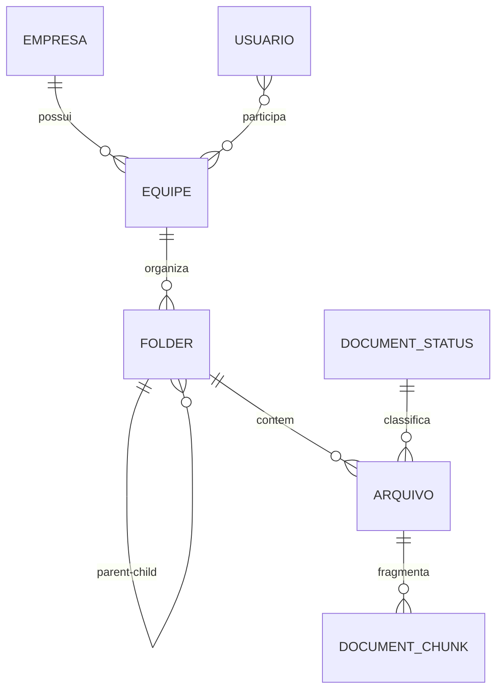

# Documentacao de Entidades do Sistema

Este documento descreve as entidades JPA do sistema, seus campos, relacionamentos e principais restricoes de banco.

## Visao Geral

As entidades principais estao no pacote `com.tcs.backnegocio.entity`:

- Empresa
- Equipe
- Usuario
- Folder
- Arquivo
- DocumentStatus
- DocumentChunk

## Relacionamentos (alto nivel)

## Entidade: Empresa

**Tabela:** `empresa`

### Campos

- `id` (Integer): chave primaria, gerada automaticamente.
- `nome` (String, obrigatorio, max 100).
- `cnpj` (String, obrigatorio, max 100).
- `dataCadastro` (LocalDate, obrigatorio, coluna `data_cadastro`).
- `idAdm` (Integer, opcional, coluna `id_adm`).
- `equipes` (List<Equipe>): relacionamento 1:N com Equipe (`mappedBy = empresa`, `cascade = ALL`, `orphanRemoval = true`).

### Regras e observacoes

- A serializacao JSON usa `@JsonManagedReference` para o lado pai de Empresa -> Equipe.

## Entidade: Equipe

**Tabela:** `equipe`

### Campos

- `id` (Integer): chave primaria, gerada automaticamente.
- `nomeEmpresa` (String, obrigatorio, max 100, coluna `nome_empresa`).
- `idAdm` (Integer, opcional, coluna `id_adm`).
- `idUser` (Integer, opcional, coluna `id_user`).
- `empresa` (Empresa): relacionamento N:1 via coluna `id_empresa`.
- `usuarios` (List<Usuario>): relacionamento N:N inverso (`mappedBy = equipes`).

### Regras e observacoes

- A serializacao JSON usa `@JsonBackReference` para evitar ciclo no lado filho de Equipe -> Empresa.
- A colecao `usuarios` e ignorada no JSON (`@JsonIgnore`).

## Entidade: Usuario

**Tabela:** `usuario`

### Campos

- `id` (Integer): chave primaria, gerada automaticamente.
- `nome` (String, obrigatorio, max 100).
- `email` (String, obrigatorio, max 100).
- `senha` (String, obrigatorio, max 100).
- `dataCadastro` (LocalDate, obrigatorio, coluna `data_cadastro`).
- `equipes` (Set<Equipe>): relacionamento N:N via tabela de juncao `usuario_equipe`.
- `admSistema` (Boolean, opcional, coluna `adm_sistema`).
- `ativo` (Boolean, obrigatorio, default `true`): flag de soft delete/logica de ativacao.

### Regras e observacoes

- O relacionamento com equipes e ignorado no JSON (`@JsonIgnore`).
- A coluna `ativo` e normalizada no `schema.sql` para ambientes existentes.

## Entidade: Folder

**Tabela:** `folder`

### Campos

- `id` (Integer): chave primaria, gerada automaticamente.
- `nome` (String, obrigatorio, max 150).
- `parent` (Folder, opcional): auto-relacionamento N:1 via `parent_id`.
- `equipe` (Equipe, obrigatorio): relacionamento N:1 via `equipe_id`.
- `isRoot` (Boolean, obrigatorio, coluna `is_root`).
- `deleted` (Boolean, obrigatorio): flag de exclusao logica.
- `dataCriacao` (LocalDateTime, obrigatorio, coluna `data_criacao`).

### Restricoes

- Unicidade composta: (`nome`, `parent_id`, `equipe_id`) com constraint `uk_folder_nome_parent_equipe`.
- Check constraint:
  - Se `is_root = true`, entao `parent_id` deve ser `NULL`.
  - Se `is_root = false`, `parent_id` pode existir.

### Regras e observacoes

- Campos `parent` e `equipe` sao ignorados no JSON (`@JsonIgnore`).

## Entidade: Arquivo

**Tabela:** `arquivo`

### Campos

- `id` (Integer): chave primaria, gerada automaticamente.
- `nome` (String, obrigatorio, max 180).
- `path` (String, obrigatorio, max 400).
- `fileHash` (String, obrigatorio, max 64, unico, coluna `file_hash`).
- `contentHash` (String, opcional, max 64, coluna `content_hash`).
- `tamanho` (Long, opcional).
- `tipo` (String, opcional, max 120).
- `folder` (Folder, obrigatorio): relacionamento N:1 via `folder_id`.
- `status` (DocumentStatus, obrigatorio): relacionamento N:1 via `status_id`.
- `totalChunks` (Integer, obrigatorio, coluna `total_chunks`).
- `deleted` (Boolean, obrigatorio): flag de exclusao logica.
- `dataUpload` (LocalDateTime, obrigatorio, nao atualizavel, coluna `data_upload`).
- `updatedAt` (LocalDateTime, obrigatorio, coluna `updated_at`).

### Restricoes

- Unicidade composta: (`nome`, `folder_id`) com constraint `uk_arquivo_nome_folder`.
- Unicidade adicional em `file_hash`.
- Chave estrangeira `status_id` para `document_status(id)`.

### Regras e observacoes

- `folder` e ignorado no JSON (`@JsonIgnore`).
- `dataUpload` usa `@CreationTimestamp`.
- `updatedAt` usa `@UpdateTimestamp`.

## Entidade: DocumentStatus

**Tabela:** `document_status`

### Campos

- `id` (Integer): chave primaria, gerada automaticamente.
- `statusName` (String, obrigatorio, unico, max 50, coluna `status_name`).

### Regras e observacoes

- Status iniciais semeados no banco:
  - `UPLOADED`
  - `PROCESSING`
  - `PROCESSED`
  - `FAILED`

## Entidade: DocumentChunk

**Tabela:** `document_chunks`

### Campos

- `id` (Long): chave primaria, gerada automaticamente.
- `document` (Arquivo, obrigatorio): relacionamento N:1 via `document_id`.
- `chunkIndex` (Integer, obrigatorio, coluna `chunk_index`).
- `pageNumber` (Integer, opcional, coluna `page_number`).
- `chunkText` (String, obrigatorio, coluna `chunk_text`, tipo `text`).
- `embedding` (float[], opcional): vetor com definicao `vector(384)`.
- `createdAt` (LocalDateTime, obrigatorio, nao atualizavel, coluna `created_at`).
- `updatedAt` (LocalDateTime, obrigatorio, coluna `updated_at`).

### Restricoes

- `document_id` possui chave estrangeira para `arquivo(id)` com `ON DELETE CASCADE`.

## Observacoes Gerais

- O projeto utiliza Lombok (`@Data`, `@Builder`, etc.) para reduzir boilerplate.
- Varias entidades aplicam `@EqualsAndHashCode` e `@ToString` excluindo relacionamentos para evitar recursao.
- Existem flags de exclusao logica em pelo menos duas entidades:
  - `usuario.ativo`
  - `folder.deleted` e `arquivo.deleted`
- O uso de `FetchType.LAZY` esta presente nos relacionamentos de maior volume (por exemplo, `Arquivo` e `Folder`) para reduzir custo de carregamento.
